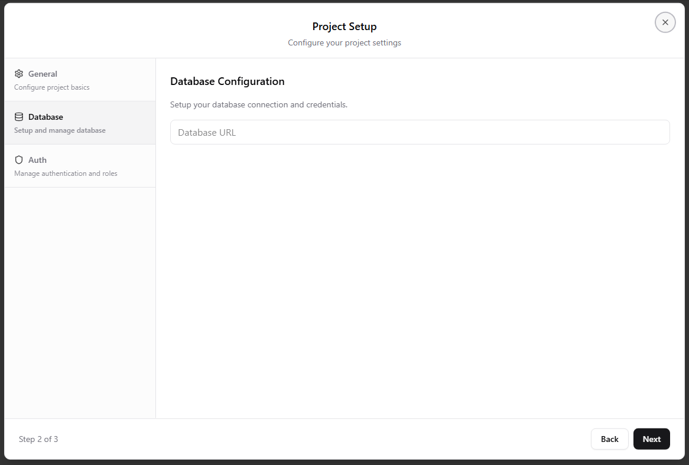
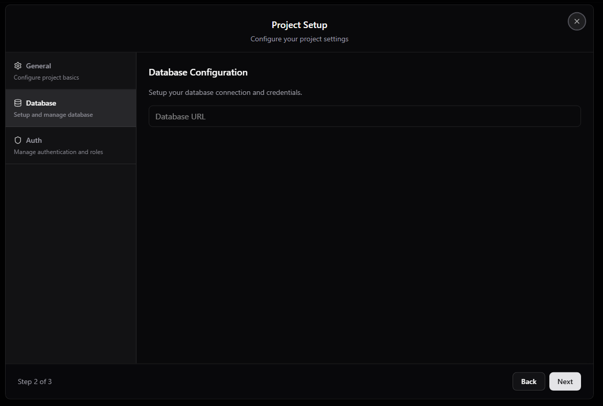
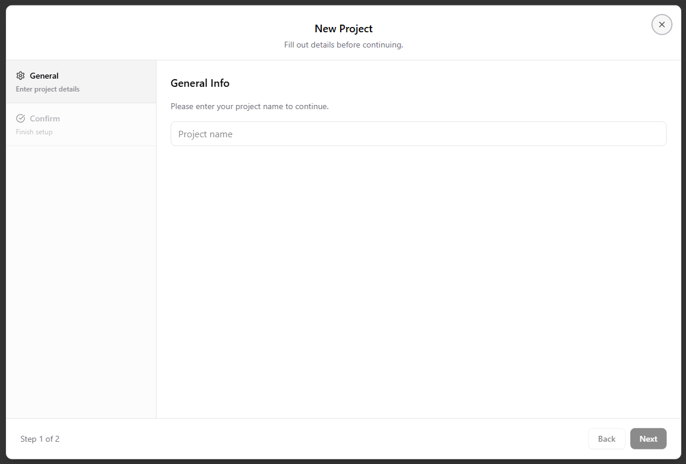
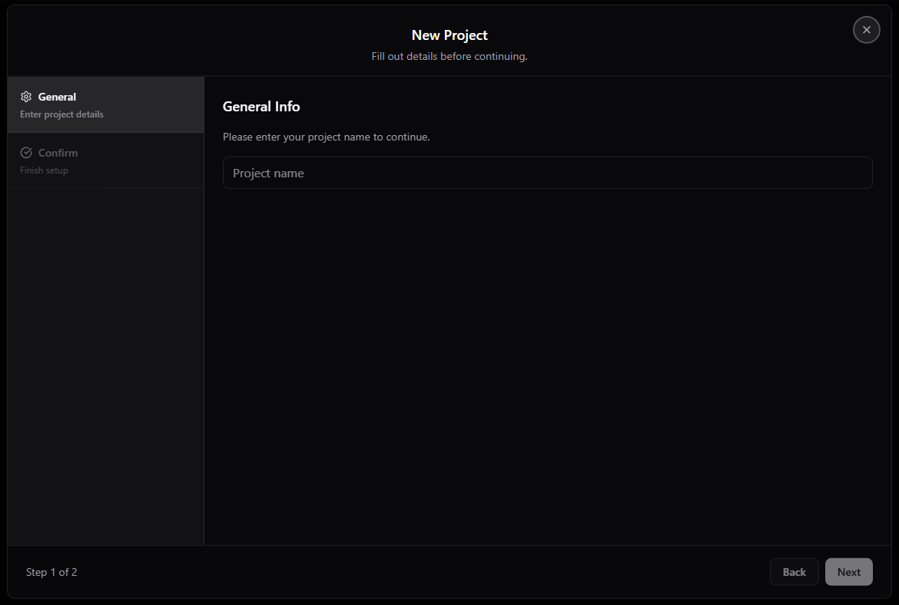

Multi-Step Form Dialog

A multi-step form dialog component that supports dynamic data, step-by-step validation, and light/dark themes.
It allows users to complete complex forms in an organized, guided flow with built-in validation logic.

🖼️ Screenshots
| Light | Dark |
|:------|:-----|
|  |  |
|  |  |

